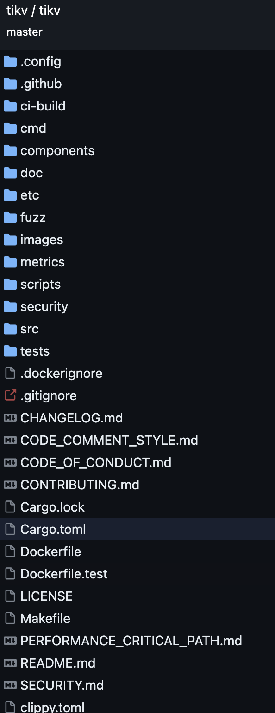

# 实际项目的组织目录
8个知名项目的项目目录
## Rust
https://github.com/rust-lang/rust

## Wasmtime
https://github.com/bytecodealliance/wasmtime

## Futures-rs
https://github.com/rust-lang/futures-rs

## async-std
https://github.com/async-rs/async-std

## Tokio
https://github.com/tokio-rs/tokio

## Rocket
https://github.com/SergioBenitez/Rocket

## Actix-web
https://github.com/actix/actix-web

## TiKV
https://github.com/tikv/tikv

